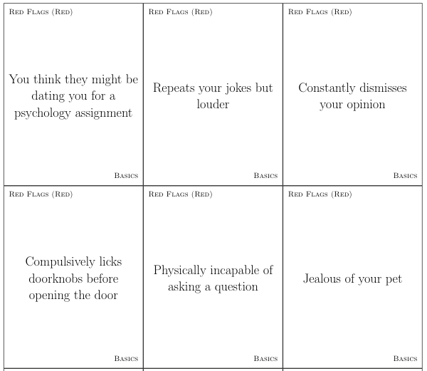

# Card Game Builder
(Lewd language warning)

### Convert card game ideas into printable PDFs you can cut out! 

Lots of card games boil down to basically just a load of creative prompts on
cardboard which you. Think 
[Cards Against Humanities](https://www.cardsagainsthumanity.com/#downloads), 
[Chameleon](https://bigpotato.com/products/the-chameleon), 
[Red Flags](https://www.timelessboardgames.co.za/boardgames/red-flags-main-game/1985), etc.

This project aims to make it simple to create your own card games by writing up
your prompts in a file. The Rust program will then convert that file to a PDF
with nicely formatted cards which you can print off, cut out, and then play
with.

### Examples
Red Flags (see `img/red_flags.pdf` for the full pdf):



So you're in a hot air balloon:


## Features

- Open source
- Multiple card games are already in the repository
- Easy (and flexible) interface via standard 
  [YAML](https://sweetohm.net/article/introduction-yaml.en.html) markup files

## Installation

Assuming you've [installed git](https://git-scm.com/downloads) and have also
[installed rust](https://www.rust-lang.org/tools/install), simply `git clone`
and then `cargo run`:

1. `git clone https://github.com/beyarkay/card_game_builder.git`
2. `cd card_game_builder`
3. `cargo run`

## PDF file to playable card game

The best way I've found is to take the PDF to a print shop, get it printed out
on card, and then ask to use their guillotine (or ask if they'll cut it up for
you).

Once you've got all your cards cut out, I _highly_ recommend buying a box or
two of small circle stickers and putting one sticker around the corner of each
playing card. This will make it obvious which game it is (ie a red circle for
the game _Red Flags_ or a black dot for _Cards Against Humanity_) and also make
it much easier to keep all the cards the right way up.

You can also often get long thin plastic boxes from a plastics warehouse which
are perfect for holding the cards.

## Creating your own card game

The Rust code expects to be given a `.yaml` file, and will write one or more
`.pdf` files. This `.yaml` file is what you'll write to describe your game, and
must include _everything_ about that game, including:

- The name of the game and version number (following [SemVer](https://semver.org/))

```yaml
name: Cards Against Humanities
version: 0.1.0
...
```

- A list of at least one `expansion`, where each `expansion` is given a name
  and then an arbitrary number of other categories:

```yaml
...
expansions:
  - default:
    name: The Default Expansion
    white_cards:
      - value 1
      - value 2
    black_cards:
      - value 1
      - value 2
```

- Each of these keys (`white_cards`, `black_cards`) will be printed off


For example `cards_against_humanities.yaml`: 
```yaml
name: Cards Against Humanities
version: 0.1.0
expansions:                     # Expansions are explained in more detail below
  - default:                    # ^^^
    name: The Default Expansion # ^^^
    white_cards:                # Category number 1
      - value 1                     # A card value
      - value 2                     # A card value
    black_cards:                # Category number 2
      - value 1                     # A card value
      - value 2                     # A card value
```

The code will enforce that the game name, at least one category, and at least
one card exist. Beyond that, there are optional extras that make the game more
playable and fun:

- Short instructions on how to play (should fit on one card)
- Number of players
- Duration of the game
- Author(s)
- Website link

For example:
```yaml
name: Cards Against Humanities
version: 1.0.0
instructions: Each round, one player asks a question with a black card, and everyone else answers with their funniest white card
num_players: 3 or more
duration: Multiple rounds of ~5 minutes each
authors: Cards Against Humanities Inc.
website: https://www.cardsagainsthumanity.com/#downloads
expansions:
  - default:
      name: The Default Expansion
      white_cards:
        - value 1
        - value 2
      black_cards:
        - value 1
        - value 2
```

The above information will be shown on the first page of the PDF, on the first
couple of cards. The date of creation will also be printed on the first few
cards.

If you've got a lot (over 500) cards, then printing them out all at once might
be too expensive. You can define _expansions_ of your card game, such that each
expansion is mutually exclusive. This allows you to first create a small batch of
cards, print them out, and then if you want to create more cards you can define
them as a second expansion in the same `.yaml` file and tell the program to only
print out the second expansion.

Or alternatively you could treat the different expansions as themes for the game,
like _The Halloween Expansion_, _The Sexy Expansion_, _The University Expansion_, 
_The "People I've Dated" Expansion_, etc:

```yaml
name: Cards Against Humanities
version: 1.0.0
instructions: Each round, one player asks a question with a black card, and everyone else answers with their funniest white card
num_players: 3 or more
duration: Multiple rounds of ~5 minutes each
authors: Cards Against Humanities Inc.
website: https://www.cardsagainsthumanity.com/#downloads
expansions:
  - default:
      name: The Default Expansion
      white_cards:
        - value 1
        - value 2
      black_cards:
        - value 1
        - value 2
  - christmas:
      name: The Christmas Expansion
      white_cards:
        - value1
      black_cards:
        - value1
  - halloween:
      name: The Halloween Expansion
      white_cards:
        - value1
      black_cards:
        - value1

```

## YAML Card Game File to PDF

This is as simple as running the Rust code and passing in the path to your
`.yaml` file. 
```sh
cargo run card_game_builder games/cards_against_humanities.yaml
```

You can optionally pass in the expansion(s) you'd like to generate as quoted
strings:
```sh
cargo run card_game_builder games/cards_against_humanities.yaml "The Sexy
Expansion" "The Chrismas Expansion"
```

The `.yaml` files are first converted to `LaTeX`, via the
[flashcards](https://www.ctan.org/tex-archive/macros/latex/contrib/flashcards/)
class, and then that `LaTeX` file is compiled to a pdf document.

## Contributions

Contributions are very welcome! And they don't have to be code either. If
you've got a card game file that you'd like to contribute, then submit a pull
request and I'll add it.

Features, bug fixes, and improvements are also welcome!

